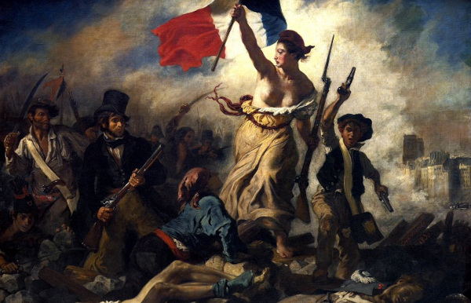

A Revolução Francesa, ciclo revolucionário que aconteceu entre 1789 e 1799, foi responsável pelo fim dos privilégios da aristocracia e pelo término do Antigo Regime.

A Queda da Bastilha aconteceu em 14 de julho de 1789 e foi o marco que espalhou a revolu&ccedil;&atilde;o pela Fran&ccedil;a.
A Queda da Bastilha aconteceu em 14 de julho de 1789 e foi o marco que espalhou a revolução pela França.
A Revolução Francesa é o nome dado ao ciclo revolucionário que aconteceu na França entre 1789 e 1799 que marcou o fim do absolutismo nesse país. Essa revolução, além de seu caráter burguês, teve uma grande participação popular e atingiu um alto grau de radicalismo, uma vez que a situação do povo francês era precária em virtude da crise que o país enfrentava.

A Revolução Francesa foi um marco na história da humanidade, porque inaugurou um processo que levou à universalização dos direitos sociais e das liberdades individuais a partir da Declaração dos Direitos do Homem e do Cidadão. Essa revolução também abriu caminho para a consolidação de um sistema republicano pautado pela representatividade popular, hoje chamado de democracia representativa. A Revolução Francesa só foi possível graças à popularização dos ideais do Iluminismo.

 

A respeito da importância da Revolução Francesa, o historiador Eric Hobsbawm afirma que

[…] a França que fez suas revoluções e a elas deu suas ideias, a ponto de bandeiras tricolores de um tipo ou de outro terem-se tornado o emblema de todas as nações emergentes […]. A França forneceu o vocabulário e os temas da política liberal e radical-democrática para a maior parte do mundo. A França deu o primeiro grande exemplo, o conceito e o vocabulário do nacionalismo. […] A ideologia do mundo moderno atingiu as antigas civilizações que tinham até então resistido às ideias europeias inicialmente através da influência francesa. Essa foi a obra da Revolução Francesa1.
